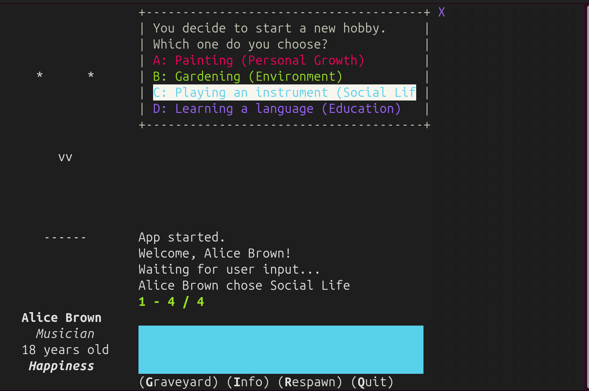
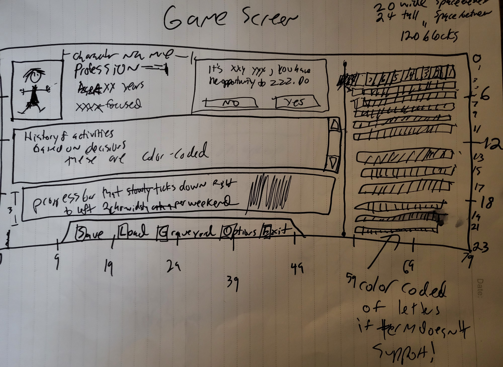
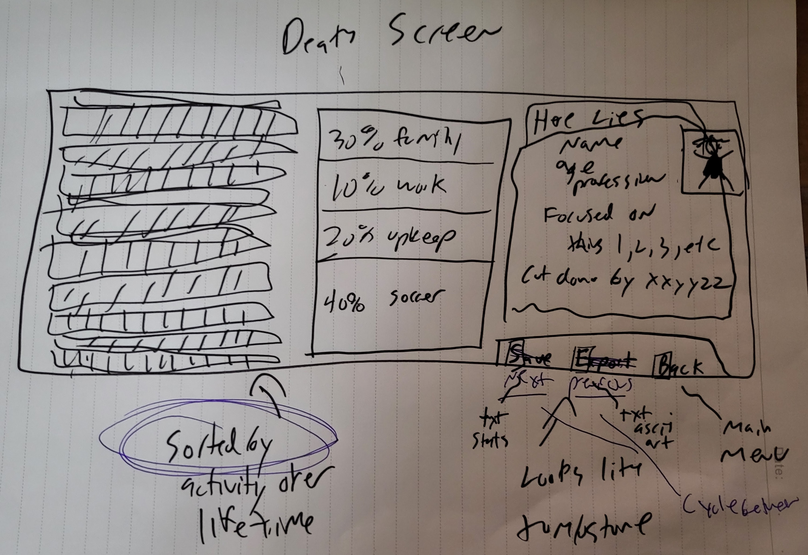
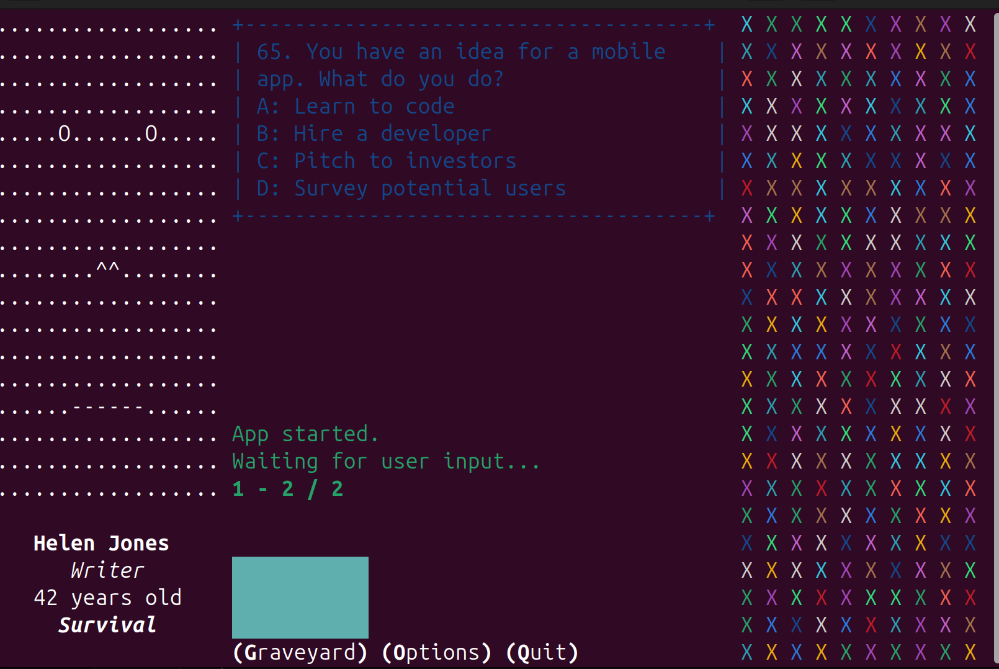

This is a Readme for a Terminal Screen Saver called 3000 (tui000).

History:

I had the idea one day just relaxing and thinking about Johnny Castaway. 
I had already ported it to as many platforms as I was interested in.
What I really missed was that feeling of fun and writing software. 

Some of my best work was made famous not by my original intention.
Rather, it was the creativity of others that brought purpose to "meaningless" software. 
After all these years, I keep coming back to the terminal. 

So, in an attempt to recreate that feeling, in the terminal, here's the start and the pitch.
You only have 3000 weekends, on average, in your adult life. The life-map assumes that each major choice you make in your life will become the focus, on average, of 12 weekends. Some a lot more, some a lot less, but on average let's take a wild swing at 12 or so. 
 
So you get 240 decisions, some many times over, with how to spend your time.  Sounds like a lot, goes by quick.  Just like life. Probably not of interest to most folks, but of great interest to me.  Useless, silly, simplistic, exactly what I had envisioned.  All future improvements are fun additions to the base concept, and I've got a ton in mind. 

Design:

Constraints: Must target / be usable in 80x24 terminal window. 

Launching the app spawns a character.
The character makes choices, indicated by colors which map to life categories. 
These choices add up to weave the tapestry of each life, the colorful headstone.
When the character dies, each is written out to a json file in ./graveyard/

Running the App:
Run with python after installing requirements.txt

Pass the -debug flag for more logging and 100x speed

Instructions During Use: 
Press the "i" key for info, right now that's just your terminal size. 
Press the "r" key to re-spawn a new character. 
Press the "g" key to enter/exit graveyard mode
While in graveyard mode, press the "right" and "left" keys to walk through the aisles of the graveyard.
While in graveyard mode, press Up and Down to highlight tombstones.
Press "q" to Quit. 

Version Just Like The Concept

Early Version -> 

